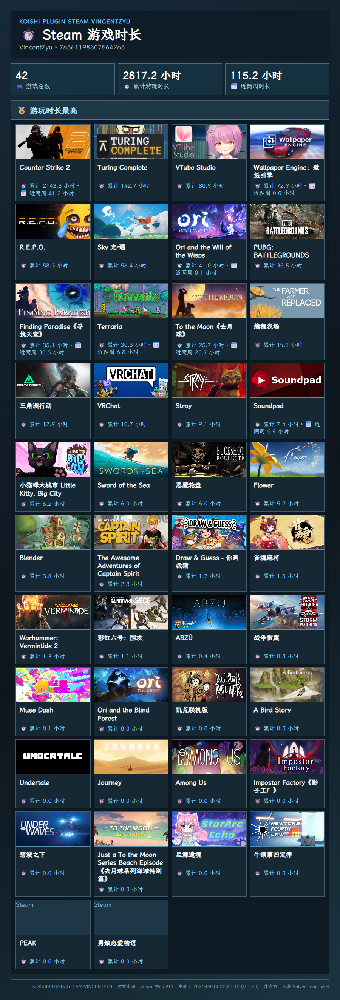

> 💡 推荐前往 [GitHub](https://github.com/VincentZyuApps/koishi-plugin-steam-vincentzyu) 或 [Gitee](https://gitee.com/vincent-zyu/koishi-plugin-steam-vincentzyu) 阅读 README，体验更好。


# 🎮 koishi-plugin-steam-vincentzyu

[](https://www.npmjs.com/package/koishi-plugin-steam-vincentzyu)
[](https://www.npmjs.com/package/koishi-plugin-steam-vincentzyu)
[](./LICENSE)

[](https://github.com/VincentZyuApps/koishi-plugin-steam-vincentzyu)
[](https://gitee.com/vincent-zyu/koishi-plugin-steam-vincentzyu)
[](https://forum.koishi.xyz/t/topic/xxxxx)
[](https://qm.qq.com/q/ZHj33L5cuC)

Steam 公开库存、游玩时长、年度回顾、状态卡与商店数据查询插件。使用 Puppeteer 渲染紧凑的 Steam 风格图片，支持 SteamID、数字好友码和 Steam 个人主页链接。

## 💬 交流反馈

🐛 Bug 反馈、💡 功能建议和 👨‍💻 插件开发交流，欢迎加入 QQ 群：**1085190201**。Koishi Forum 帖子将在创建后替换上方占位链接。

## ⚠️ 依赖与准备

插件需要 Koishi 的以下服务：

- 💾 `database`：保存每个用户的 Steam 绑定。
- 🖼️ `puppeteer`：渲染帮助、库存、排行、特惠和状态图片。
- 🌐 `http`：访问 Steam Web API、Steam Community 和 Steam 商店。

需要 Steam Web API Key 的功能，请至少配置一个 `apiKeys`。启用插件代理前，请在 Koishi 全局启用 `proxy-agent`；本插件只在自己的请求上带代理地址，不会重复注册共享代理插件，因此支持 HMR 热重载。

## 🚀 快速开始

1. 在 Koishi 控制台安装并启用本插件，以及 `database`、`puppeteer`、`http` 服务。
2. 在插件配置中填写 Steam Web API Key；网络受限时配置代理范围和代理地址。
3. 发送 `steam.绑定 <SteamID>`，再发送 `steam` 查看帮助图片。

```text
steam.绑定 76561198307564265
steam.库存
steam.状态
steam.特惠
```

## 📖 指令对照

`Arg` 是位置参数，尖括号表示必填、方括号表示可选。`Option` 是 Koishi 的短/长命令选项，例如 `-y` 或 `--year`；当前版本所有输入均通过位置参数传递，因此该列均为“无”。

| Koishi 指令 | 上游 Yunzai steam-plugin 对应指令 | Arg（位置参数） | Option（命令选项） | 说明 |
| --- | --- | --- | --- | --- |
| `steam` / `steam.help` / `steam.帮助` | `#steam帮助` | 无 | 无 | 返回帮助图片。 |
| `steam.绑定 <target>` | `#steam绑定 <SteamID>` | `target`：必填；SteamID、数字好友码或个人主页链接 | 无 | 绑定账号，并设为主账号。 |
| `steam.绑定列表` | `#steam` | 无 | 无 | 查看当前会话已绑定账号。 |
| `steam.切换 <index>` | `#steam绑定 <SteamID/序号>` | `index`：必填正整数 | 无 | 按绑定列表序号切换主账号。 |
| `steam.解绑 <index>` | `#steam解绑 <SteamID/序号>` | `index`：必填正整数 | 无 | 解除指定绑定。 |
| `steam.库存 [target]` | `#steam库存` | `target`：可选；省略时使用主账号 | 无 | 查看公开库存和游戏封面。 |
| `steam.游戏时长 [target]` | `#steam游戏时长` | `target`：可选；省略时使用主账号 | 无 | 按累计游玩时长展示游戏。 |
| `steam.最近游玩 [target]` | `#steam最近游玩` | `target`：可选；省略时使用主账号 | 无 | 查看近两周公开游玩记录。 |
| `steam.年度回顾 [year] [target]` | `#steam年度回顾分享图片 [year] [SteamID/序号]` | `year`：可选年份；`target`：可选目标 | 无 | 查看 Steam Replay 分享图；年份省略时使用最近可用年度。 |
| `steam.状态 [target]` / `steam.信息` / `steam.info` / `steam.status` | `#steam状态` / `#steam信息` | `target`：可选；省略时使用主账号 | 无 | 查看公开资料、在线状态与正在游玩的游戏。 |
| `steam.当前热玩` | `#steam当前热玩` | 无 | 无 | 实时在线人数最高的游戏。 |
| `steam.每日热玩` | `#steam每日热玩` | 无 | 无 | 每日峰值玩家排行。 |
| `steam.热门新品` | `#steam热门新品` | 无 | 无 | Steam 月度热门新品。 |
| `steam.本周热销` | `#steam本周热销` | 无 | 无 | Steam 当前热销排行。 |
| `steam.上周热销` | `#steam上周热销` | 无 | 无 | Steam 上周热销排行。 |
| `steam.年度排行 [type] [year]` | `#steam年度…排行 [year]` | `type`：可选，畅销/新品/VR/抢先体验/热玩/Deck/控制器；`year`：可选年份 | 无 | Steam 年度最佳排行；省略时为最近年度的热玩。 |
| `steam.特惠` | `#steam特惠` / `#steam优惠` | 无 | 无 | 单图展示优惠、即将推出、热销和新品四分区。 |

## 💬 会话回复

| 配置项 | 类型 | 默认值 | 说明 |
| --- | --- | --- | --- |
| `enableQuote` | `boolean` | `true` | 所有指令的文本、图片、错误与等待提示是否引用触发消息。 |
| `enableWaitingHint` | `boolean` | `true` | Steam API 获取、图片下载或 Puppeteer 渲染时是否显示并自动撤回等待提示。 |

等待提示为 `⏳ 正在获取 Steam 数据并渲染图片，请稍候... 🎨`。平台不支持撤回或 Bot 没有撤回权限时，不影响最终回复。

## 🔧 配置项

### 🎮 Steam 数据

| 配置项 | 默认值 | 说明 |
| --- | --- | --- |
| `apiKeys` | `[]` | Steam Web API Key 列表；请求会轮询 Key，429 后暂时避开当前 Key。 |
| `countryCode` | `CN` | Steam 商店地区代码，例如 `CN`、`US`、`HK`。 |
| `timeout` | `15` | Steam 请求超时秒数，范围 3-60。 |
| `cacheSeconds` | `120` | 公共数据进程内缓存秒数，范围 0-3600。 |

### 🔌 网络与代理

| 配置项 | 默认值 | 说明 |
| --- | --- | --- |
| `proxyMode` | `disabled` | `disabled`、`data`、`data-and-images`；后两者分别代理数据，或同时代理数据与封面图片。 |
| `proxy.protocol` | `http` | 支持 `http`、`https`、`socks4`、`socks5`、`socks5h`。 |
| `proxy.host` | `127.0.0.1` | 代理服务器地址。 |
| `proxy.port` | `7891` | 代理服务器端口，范围 1-65535。 |

### 🖼️ 出图与条目数

| 配置项 | 默认值 | 说明 |
| --- | --- | --- |
| `inventoryLimit` | `50` | 库存、游戏时长和最近游玩图片最多展示的游戏数。 |
| `rankingLimit` | `20` | 单一排行榜图片最多展示的条目数。 |
| `storefrontSpecialsLimit` | `10` | 特惠图“优惠”分区展示条数；`0` 表示完整展示。 |
| `storefrontComingSoonLimit` | `10` | 特惠图“即将推出”分区展示条数；`0` 表示完整展示。 |
| `storefrontTopSellersLimit` | `10` | 特惠图“热销”分区展示条数；`0` 表示完整展示。 |
| `storefrontNewReleasesLimit` | `10` | 特惠图“新品”分区展示条数；`0` 表示完整展示。 |
| `imageWidth` | `900` | Puppeteer 图片宽度，范围 640-1600 px。 |
| `imageType` | `png` | 输出格式：`png`、`jpeg` 或 `webp`。 |
| `screenshotQuality` | `88` | JPEG/WebP 图片质量，范围 30-100；PNG 不受影响。 |
| `fontMode` | `npm-lxgw` | 图片字体：npm 内置霞鹜文楷、指定绝对路径或系统默认字体。 |
| `customFontPath` | `""` | 自定义字体绝对路径，仅指定字体模式生效。 |

<!-- SCREENSHOTS:START -->
## 🖼️ 指令效果图

截图由 `yarn screenshots:readme` 使用当前 Steam 数据生成；数据可能随 Steam 实时变化。

### 📖 Steam 帮助


### 🔗 Steam 绑定列表


### 🎒 Steam 库存


### ⏱️ Steam 游戏时长



### 🕹️ Steam 最近游玩


### 📅 2025 年度回顾


### 👤 Steam 状态


### 🔥 当前热玩排行榜


### 📈 每日热玩排行榜


### 🆕 热门新品排行榜


### 🛒 本周热销排行榜


### 🕘 上周热销排行榜


### 🏆 2025 年度热玩排行

> ⚠️ 当前未生成该指令截图：fetch https://store.steampowered.com/charts/bestofyear/bestof2025 failed。详见 [截图生成报告](docs/screenshots/report.md)。

### 🎁 Steam 商店推荐


<!-- SCREENSHOTS:END -->

## 🎨 出图风格

渲染图采用深蓝渐变、冷青细线与紧凑信息布局，借鉴 Steam 信息界面但不逐像素复刻。矩形内容区、封面和标签使用直角；仅头像、序号徽章等语义圆形元素保留圆形。每张图片页脚会标明插件名、数据来源、UTC+8 生成时间与非官方声明。

## 🧪 README 截图自动化

在插件目录执行：

```bash
yarn screenshots:readme
```

脚本默认读取上级 Koishi 工作区的 `koishi.yml`，使用 `onebot:1830540513` 的主 Steam 绑定生成截图。支持 `--config <路径>`、`--output <路径>`、`--uid <平台:用户ID>` 与 `--year <年份>` 覆盖默认值，例如：

```bash
yarn screenshots:readme --uid onebot:1830540513 --year 2025
```

API Key、代理与数据库凭据仅在运行时读取，不会写入脚本、截图报告、README 或 Git。截图中的固定账号 Steam 公开资料、SteamID、库存与游玩数据会原样提交；无法获取的单项会在控制台、README 与 `docs/screenshots/report.md` 中明确标为缺失。

## ⚠️ 注意事项

- Steam 资料、库存、近期游玩和年度回顾必须公开，且 Steam 服务本身可能限流或暂时不可用。
- 年度回顾由 Steam 决定是否生成；没有分享图时插件会给出对应 Steam Replay 链接。
- 商店排行和特惠内容随地区、时间和 Steam 服务返回变化。
- 使用代理模式前必须启用 Koishi 全局 `proxy-agent`。

## ⚖️ 商标声明

本项目为非官方、免费开源的社区插件，与 Valve Corporation 或 Steam 无关联，亦未获其认可或背书。Steam 是 Valve Corporation 的商标及/或注册商标。本项目不使用 Steam 官方图标作为自身插件标识。
